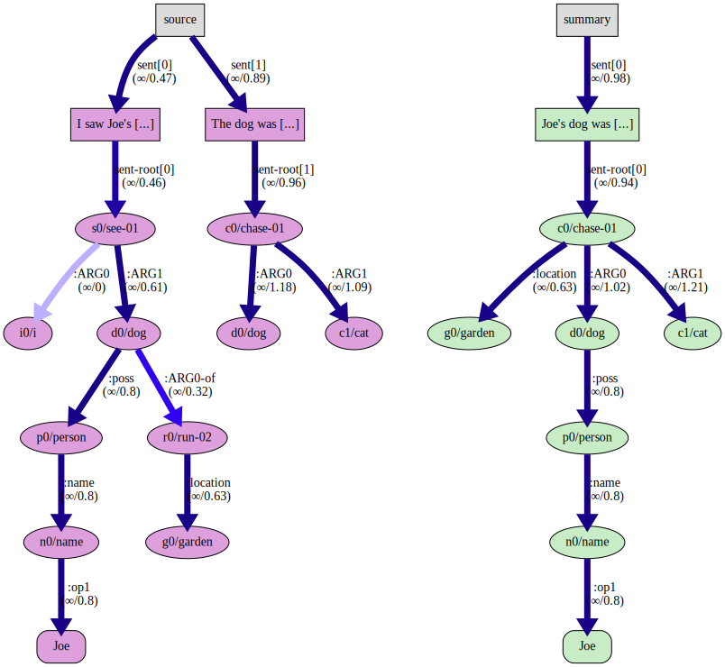
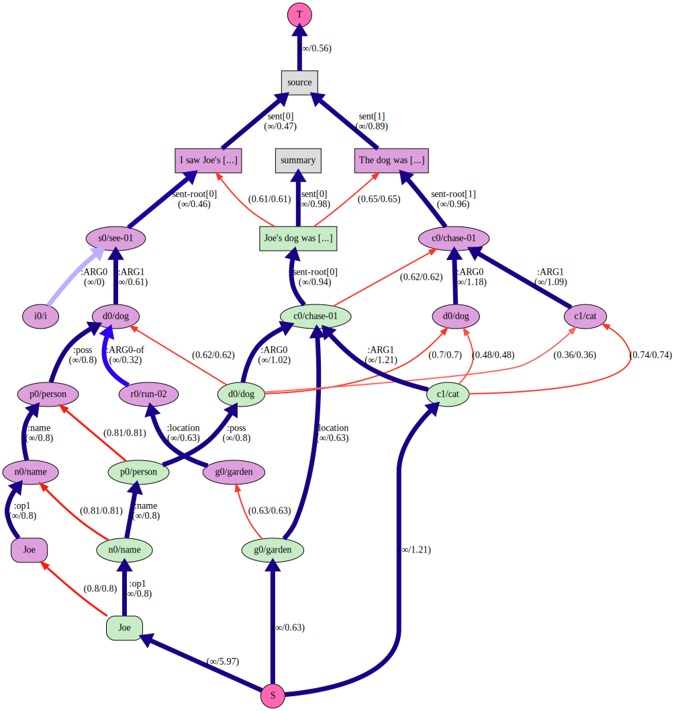
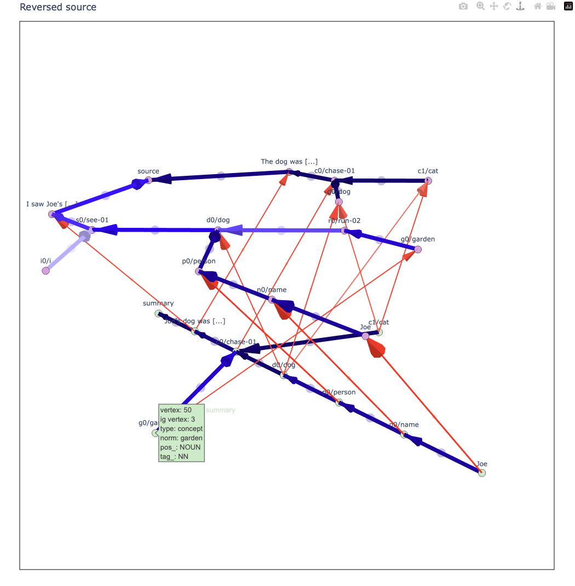

# CALAMR: Component ALignment for Abstract Meaning Representation

[![PyPI][pypi-badge]][pypi-link]
[![Python 3.11][python311-badge]][python311-link]
[![Build Status][build-badge]][build-link]

This repository contains code for the paper [CALAMR: Component ALignment for
Abstract Meaning Representation] and aligns the components of a bipartite
source and summary AMR graph.  To reproduce the results of the paper, see the
[paper repository](https://github.com/uic-nlp-lab/calamr).

The results are useful as a semantic graph similarity score (like SMATCH) or to
find the summarized portion (as AMR nodes, edges and subgraphs) of a document
or the portion of the source that represents the summary.  If you use this
library or the [PropBank API/curated database], please [cite](#citation) our
paper.

Features:

* Align source/summary AMR graphs.
* Scores for extent to which AMRs are summarized or represented in their source
  text.
* Rendering of the alignments.
* Support for four AMR [corpora](#corpora).
* High-level, how-to and API
  [documentation](https://plandes.github.io/calamr/index.html).


<!-- markdown-toc start - Don't edit this section. Run M-x markdown-toc-refresh-toc -->
## Table of Contents

- [Documentation](#documentation)
- [Installing](#installing)
- [Corpora](#corpora)
- [Usage](#usage)
    - [Command Line](#command-line)
        - [Ad hoc Corpora](#ad-hoc-corpora)
        - [Aligning Corpus Documents](#aligning-corpus-documents)
        - [Multiple Ad hoc Corpora](#multiple-ad-hoc-corpora)
    - [AMR Release 3.0 Corpus (LDC2020T02)](#amr-release-30-corpus-ldc2020t02)
    - [API](#api)
        - [Aligning Ad hoc Documents](#aligning-ad-hoc-documents)
        - [Aligning Corpora Documents](#aligning-corpora-documents)
    - [Docker](#docker)
- [Configuration](#configuration)
    - [Text Alignments](#text-alignments)
    - [Multiprocessing](#multiprocessing)
- [Example Graphs](#example-graphs)
    - [GraphViz](#graphviz)
        - [The Nascent Graph (with flow data)](#the-nascent-graph-with-flow-data)
        - [The Source Graph](#the-source-graph)
    - [Plotly](#plotly)
- [Attribution](#attribution)
- [Citation](#citation)
- [Changelog](#changelog)
- [License](#license)

<!-- markdown-toc end -->


## Documentation

The recommended reading order for this project:

1. See the [Ad hoc Corpora](#ad-hoc-corpora) as a quick start.
1. The [conference slides](https://plandes.github.io/calamr/doc/CalamrSlides.pdf)
1. The abstract and introduction of the paper [CALAMR: Component ALignment for
   Abstract Meaning Representation]
1. [Overview and implementation guide](https://plandes.github.io/calamr/doc/CalamrImplementGuide.pdf)
1. [Full documentation](https://plandes.github.io/calamr/index.html)
1. [API reference](https://plandes.github.io/calamr/api.html)


## Installing

Because the this library has many dependencies and many moving parts, it is
best to create a new environment using [conda]:

```bash
wget https://github.com/plandes/calamr/raw/refs/heads/master/environment.yml
conda env create -f environment.yml
conda activate calamr
```

The library can also be installed with pip from the [pypi] repository:
```bash
pip3 install zensols.calamr
```

See [Installing the Gsii Model].


## Corpora

This repository contains code to support the following corpora with
source/summary AMR for alignment:

* [LDC2020T02] (AMR Release 3.0) Proxy Corpus
* [ISI] Little Prince
* [ISI] Bio AMR
* A [micro corpus] (toy corpus) used in the paper examples and [usage](#usage).


## Usage

The command-line tool and API does not depend on the repository.  However, it
has a template configuration file that both the CLI and the API use.  The
examples also use data in the repository.  Do the following to get started:

1. Clone this repository and change the working directory to it:
   ```bash
   git clone https://github.com/plandes/calamr && cd calamr
   ```
1. Copy the resource file:
   ```bash
   cp config/dot-calamrrc ~/.calamrrc
   ```


### Command Line

The steps below show how to use the command-line tool.  First set up the
application environment:

1. Edit the `~/.calamrrc` file to choose the corpus and visualization.  Keep
   the `calamr_corpus` set to `adhoc` for these examples.  (Note that you can
   also set the the `CALAMRRC` environment variable to a file in a different
   location if you prefer.)
1. Create the micro corpus:
   ```bash
   calamr mkadhoc --corpusfile corpus/micro/source.json
   ```
1. Print the document keys of the corpus:
   ```bash
   calamr keys
   ```


#### Ad hoc Corpora

The [micro corpus] can be edited and rebuilt to add your own data to be
aligned.  However, there's an easier way to align ad hoc documents.

1. Align a summarized document not included in any corpus.  First create the
   annotated documents as files `short-story.json`.
   ```json
   [
	   {
		   "id": "intro",
		   "body": "The Dow Jones Industrial Average and other major indexes pared losses.",
		   "summary": "Dow Jones and other major indexes reduced losses."
	   },
	   {
		   "id": "dow-stats",
		   "body": "The Dow ended 0.5% lower on Friday while the S&P 500 fell 0.7%. Among the S&P sectors, energy and utilities gained while technology and communication services lagged.",
		   "summary": "Dow sank 0.5%, S&P 500 lost 0.7% and energy, utilities up, tech, comms came down."
	   }
   ]
   ```
   Now align the documents using the `XFM Bart Base` AMR parser, rendering
   with the maximum number of steps (`-r 10`), and save results to `example`:
	```bash
	calamr align short-story.json --override amr_default.parse_model=xfm_bart_base -r 10 -o example -f txt
	```

The `-r` option controls how many intermediate graphs generated to show the
iteration of the algorithm over all the steps (see the paper for details).  It
is possible to align ad hoc documents
[programmatically](#aligning-ad-hoc-documents) as well.


#### Aligning Corpus Documents

AMR corpora that distinguish between source and summary documents are needed so
the API knows what data to align.  The following examples utilize preexisting
corpora (including the last section's micro corpus):

1. Generate the Liu et al. graph for the micro corpus in directory `example`:
	```bash
	calamr aligncorp liu-example -f txt -o example
	```
1. Force the *Little Prince* AMR corpus download and confirm success with the
   single document key `1943`:
	```bash
	calamr keys --override=calamr_corpus.name=little-prince
	```
1. Use the default AMR parser to extract sentence text from the *Little Prince*
	AMR corpus using the [SPRING] (Bevilacqua et al. 2021) parser:
	```bash
	calamr penman -o lp.txt --limit 5 \
		--override amr_default.parse_model=spring \
		~/.cache/calamr/corpus/amr-rel/amr-bank-struct-v3.0.txt
	```
1. Score the parsed sentences using CALAMR, SMATCH and WLK:
	```bash
	calamr score --parsed lp.txt \
		--methods calamr,smatch,wlk \
		~/.cache/calamr/corpus/amr-rel/amr-bank-struct-v3.0.txt
	```


#### Multiple Ad hoc Corpora

Multiple ad hoc corpora can coexist in one project.  See the [multiple corpora
example](example/multicorp).  This examples demonstrates:

* Creating corpora from JSON files with source/summary pairs.
* Aligning the corpora.
* Programmatically accessing the corpus and caching flow results.


### AMR Release 3.0 Corpus (LDC2020T02)

If you are using the AMR 3.0 corpus, there is a preprocessing step that needs
executing before it can be used.

The Proxy Report corpus from the AMR 3.0 does not have both the `alignments`
(text-to-graph alignments) and `snt-type` (indicates if a sentence is part of
the source or the summary) metadata.  By default, this API expects both.  To
merge them into one dataset do the following:

1. [Obtain or purchase](https://catalog.ldc.upenn.edu/LDC2020T02) the corpus.
1. Move the file where the software can find it:
   ```bash
   mkdir ~/.cache/calamr/download
   cp /path/to/amr_annotation_3.0_LDC2020T02.tgz ~/.cache/calamr/download
   ```
1. Merge the alignments and sentence descriptors:
   ```bash
   ./src/bin/merge-proxy-anons.py
   ```
1. Confirm the merge was successful by printing the document keys and align a report:
   ```bash
   calamr keys --override=calamr_corpus.name=proxy-report
   calamr aligncorp 20041010_0024 -f txt -o example \
	   --override calamr_corpus.name=proxy-report
   ```

### API

This section explains how to use the library's API directly in Python.


#### Aligning Ad hoc Documents

You can parse an align documents without setting up a corpus first.  To do
this, there is an ad API that creates the same data files as when using with a
corpus, but in a different file system space.  It optionally takes the name of
the corpus for this name space.  If not provided one is created by hashing the
data given to the API.

An example of how to parse and align ad hoc documents follows

```python
from typing import List, Dict
from zensols.amr import AmrFeatureDocument
from zensols.calamr import (
    DocumentGraph, FlowGraphResult, Resources, ApplicationFactory
)

# import and get the Resources bundle
resources: Resources = ApplicationFactory.get_resources()

# create corpus data (toy two-document corpus for this example)
corpus: List[Dict[str, str]] = [{
    "id": "first",
    "body": "The rulings bolster criticisms of how hastily the prosecutions were brought. The rulings were rushed.",
    "summary": "The rulings suggest the prosecutions were rushed."
}]

# parse and access an ad hoc corpus as defined above with the list
# of dictionaries above
with resources.adhoc(corpus) as r:
    # list the keys in the corpus, each of which is available as a document or
    # alignment as flow metrics/data
    keys = tuple(r.documents.keys())
    print(keys)

    # get a document, which parses the document (if they aren't already); this
    # step isn't necessary if you want to go right to the alignments
    doc: AmrFeatureDocument = r.documents['first']
    doc.write()

# get and visualize the results (for documentation purposes, a new ``with`` is given)
with resources.adhoc(corpus) as r:
    # get an alignment, which parses alignments (if not already)
    flow: FlowGraphResult = r.alignments['first']
    # write the metrics (or flow.stats to get a simle dictionary)
    flow.write()
    # render the results of a flow
    flow.render()
    # render all graphs of the flow results of the flow to directory `example`
    flow.render(
        contexts=flow.get_render_contexts(include_nascent=True),
        directory=Path('example'),
        display=False)
```

output:
```yaml
summary:
    The rulings suggest the prosecutions were rushed.
sections:
    no section sentences
        The rulings bolster criticisms of how hastily the prosecutions were brought.
        The rulings were rushed.
statistics:
    agg:
        aligned_portion_hmean: 0.7777777777777779
        mean_flow: 0.7187621593475342
        tot_alignable: 16
        tot_aligned: 12
        aligned_portion: 0.75
        reentrancies: 0
...
```


#### Aligning Corpora Documents

You can access existing corpora (the "micro" corpus, The Little Prince,
Biomedical Corpus, or Proxy report 3.0) as discussed in [Aligning Corpus
Documents](#aligning-corpus-documents).  The following API can be used, which
is similar to the [Aligning Ad hoc Documents](#aligning-ad-hoc-documents)
example but use a corpus. All the same resources are available in the ``with
resource.corpus`` scope:

```python
# import and get the resource bundle
from zensols.amr import AmrFeatureDocument
from zensols.calamr import FlowGraphResult, Resources, ApplicationFactory

# get the resource bundle
resources: Resources = ApplicationFactory.get_resources()
# get the Liu et al. AMR feature document example and print it,
# this accesses the corpus in the `./download` directory
with resources.corpus() as r:
    # get a document, which parses the document (if they aren't already); this
    # step isn't necessary if you want to go right to the alignments
    doc: AmrFeatureDocument = r.documents['liu-example']
    doc.write()
```

output:
```yaml
[T]: Joe's dog was chasing a cat in the garden. I saw Joe's dog, which was running in the garden. The dog was chasing a cat.
sentences:
    [N]: Joe's dog was chasing a cat in the garden.
        (c0 / chase-01~e.4
              :location (g0 / garden~e.9)
              :ARG0 (d0 / dog~e.2
                    :poss (p0 / person
                          :name (n0 / name
                                :op1 "Joe"~e.0)))
              :ARG1 (c1 / cat~e.6))
.
.
.
amr:
    summary:
        Joe's dog was chasing a cat in the garden.
    sections:
        no section sentences
            I saw Joe's dog, which was running in the garden.
            The dog was chasing a cat.
```

See [configuration](#text-alignments) regarding text alignments.


### Docker

A stand-alone docker image is also available (see [CALAMR Docker
image](./docker)).  This [docker image] provides stand-alone container with all
models, configuration and the ad hoc micro corpus installed.


## Configuration

To modify the configuration, create an `ini` file in `~/.calamrrc`.


### Text Alignments

The program was built to deal with data using the corpora API.  However, ad hoc
documents can be aligned but they document graphs will not have the text
alignments.  To enable that, in your `~/.calamrrc` add the following:'

```ini
# include alignments in ad hoc parsed documents
[amr_anon_doc_factory]
remove_alignments = False
```

### Multiprocessing

By default, corpus documents are lazy-aligned from the
[`Resources.get_corpus_document`](#aligning-corpora-documents) method.
However, the entire corpus can be aligned across multiple processes.  In this
case, the first access to the first document will start the processing, and
will not return until the entire dataset is aligned.  This is enabled by
setting the following configuration:

```ini
# use 4 processes to align the corpus
[calamr_default]
flow_graph_result_caching = preemptive
preemptive_workers = 4
```


## Example Graphs

The Liu et al. example graphs were created from the last step of the
[API](#api) examples, which is equivalent the first step of the [command line
example](#aligning-corpus-documents).


### GraphViz

To create these graphs, set your `~/.calamrrc` configuration to:

```ini
[calamr_default]
renderer = graphviz
```

#### The Nascent Graph (with flow data)

<p align="center">
	
</p>


#### The Source Graph

<p align="center">
	
</p>


### Plotly

To create these graphs, set your `~/.calamrrc` configuration to:

```ini
[calamr_default]
renderer = plotly
```

See the [interactive version](https://plandes.github.io/calamr/doc/graphs/liu-source-plotly.html).
[](https://plandes.github.io/calamr/doc/graphs/liu-source-plotly.html)


## Attribution

This project, or reference model code, uses:

* Python 3.11
* [amrlib] for AMR parsing.
* [amr_coref] for AMR co-reference
* [zensols.amr] for AMR features and summarization data structures.
* [Sentence-BERT] embeddings
* [zensols.propbankdb] and [zensols.deepnlp] for PropBank embeddings
* [zensols.nlparse] for natural language features and [NLP scoring]
* [Smatch] (Cai and Knight. 2013) and [WLK] (Opitz et. al. 2021) for scoring.


## Citation

If you use this project in your research please use the following BibTeX entry:

```bibtex
@inproceedings{landes-di-eugenio-2024-calamr-component,
    title = "{CALAMR}: Component {AL}ignment for {A}bstract {M}eaning {R}epresentation",
    author = "Landes, Paul  and
      Di Eugenio, Barbara",
    editor = "Calzolari, Nicoletta  and
      Kan, Min-Yen  and
      Hoste, Veronique  and
      Lenci, Alessandro  and
      Sakti, Sakriani  and
      Xue, Nianwen",
    booktitle = "Proceedings of the 2024 Joint International Conference on Computational Linguistics, Language Resources and Evaluation (LREC-COLING 2024)",
    month = may,
    year = "2024",
    address = "Torino, Italy",
    publisher = "ELRA and ICCL",
    url = "https://aclanthology.org/2024.lrec-main.236",
    pages = "2622--2637"
}
```


## Changelog

An extensive changelog is available [here](CHANGELOG.md).


## License

[MIT License](LICENSE.md)

Copyright (c) 2023 - 2025 Paul Landes


<!-- links -->
[pypi]: https://pypi.org/project/zensols.calamr/
[pypi-link]: https://pypi.python.org/pypi/zensols.calamr
[pypi-badge]: https://img.shields.io/pypi/v/zensols.calamr.svg
[python310-badge]: https://img.shields.io/badge/python-3.10-blue.svg
[python310-link]: https://www.python.org/downloads/release/python-3100
[python311-badge]: https://img.shields.io/badge/python-3.11-blue.svg
[python311-link]: https://www.python.org/downloads/release/python-3110
[build-badge]: https://github.com/plandes/calamr/workflows/CI/badge.svg
[build-link]: https://github.com/plandes/calamr/actions

[micro corpus]: corpus/micro/source.json
[LDC2020T02]: https://catalog.ldc.upenn.edu/LDC2020T02
[SPRING]: https://github.com/SapienzaNLP/spring
[CALAMR: Component ALignment for Abstract Meaning Representation]: https://aclanthology.org/2024.lrec-main.236/
[ISI]: https://amr.isi.edu
[conda]: https://docs.anaconda.com/miniconda/

[amrlib]: https://github.com/bjascob/amrlib
[amr_coref]: https://github.com/bjascob/amr_coref
[spaCy]: https://spacy.io
[Smatch]: https://github.com/snowblink14/smatch
[WLK]: https://github.com/flipz357/weisfeiler-leman-amr-metrics
[zensols.nlparse]: https://github.com/plandes/nlparse
[NLP scoring]: https://plandes.github.io/nlparse/api/zensols.nlp.html#zensols-nlp-score
[Sentence-BERT]: https://www.sbert.net
[docker image]: https://hub.docker.com/r/plandes/calamr
[zensols.amr]: https://github.com/plandes/amr
[zensols.deepnlp]: https://github.com/plandes/deepnlp
[zensols.propbankdb]: https://github.com/plandes/propbankdb
[PropBank API/curated database]: https://github.com/plandes/propbankdb
[Installing the Gsii Model]: https://github.com/plandes/amr#installing-the-gsii-model
